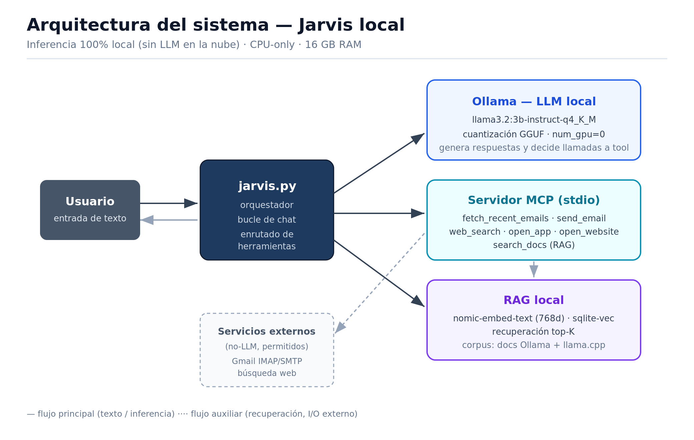
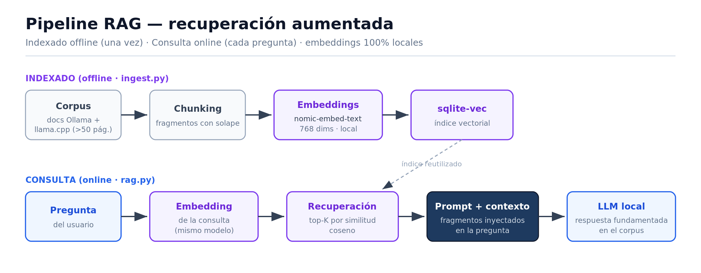
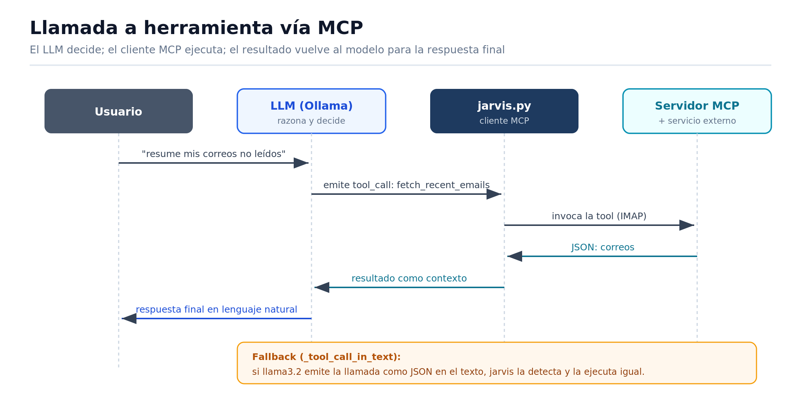
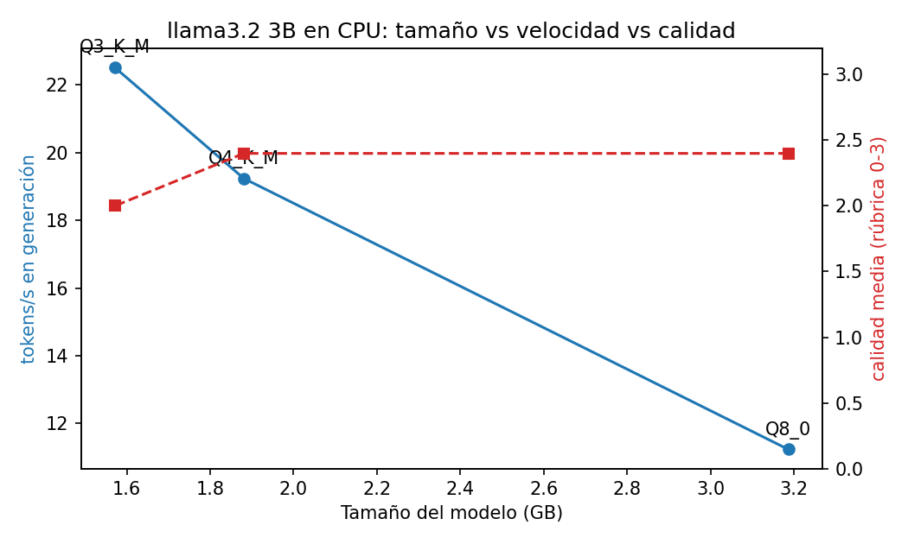
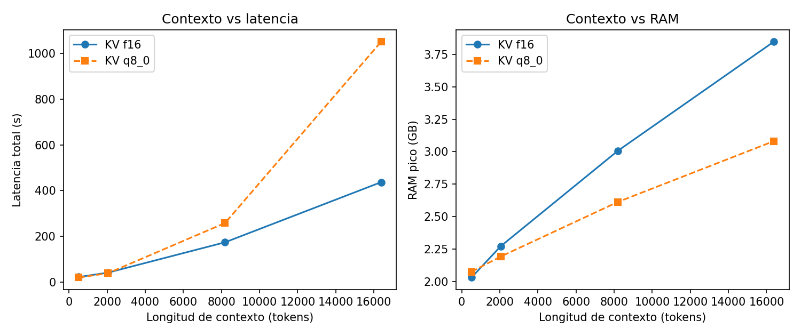

# 1. Abstract

Presentamos IRONMAN, un asistente personal tipo "Jarvis" que corre íntegramente
en la CPU de un portátil con menos de 16 GB de RAM, sin ningún LLM en la nube.
El sistema combina un modelo llama3.2 de 3B parámetros servido por Ollama, un
pipeline RAG local (nomic-embed-text + sqlite-vec) sobre ~202 páginas de
documentación técnica, y seis herramientas expuestas mediante un servidor
propio del Model Context Protocol (MCP), incluyendo correo IMAP/SMTP y control
del PC. La interfaz principal es de texto (`jarvis.py`). Medimos el
efecto de tres niveles de cuantización (Q8_0, Q4_K_M, Q3_K_M) sobre tamaño,
RAM y velocidad; verificamos el crecimiento aproximadamente lineal del KV
cache entre 512 y 16 384 tokens de contexto y el ahorro de cuantizarlo a Q8;
y evaluamos el sistema completo con un test set reproducible de 21 prompts en
cinco categorías. El hallazgo principal: Q4_K_M es el mejor compromiso
—~1.7× más tokens/s que Q8_0 con idéntica calidad media (2.4/3)—, mientras
Q3_K_M la degrada a 2.0 al fallar la aritmética; y el KV cache medido crece
~117 KB/token, casi exactamente los 112 KB/token teóricos, confirmando su
crecimiento lineal con el contexto.

# 2. Arquitectura del sistema



*Figura 1. Arquitectura general. El usuario interactúa por texto con
`jarvis.py`, que orquesta la inferencia local (Ollama), la llamada a
herramientas (MCP) y la recuperación (RAG). Ningún componente de inferencia
sale a la nube.*

La interfaz del núcleo es de texto (`jarvis.py`), la misma que usa la
evaluación automática de la Parte E. Todas las llamadas de inferencia fijan
`num_gpu: 0`: el equipo tiene una RTX 4060 que se deshabilita explícitamente
para cumplir la restricción de hardware del enunciado.

El servidor MCP propio (`mcp_server.py`) expone seis herramientas por
stdio: `fetch_recent_emails` y `send_email` (Gmail IMAP/SMTP), `open_app`,
`open_website` y `web_search` (control del PC y búsqueda), y `search_docs`
(puente al RAG sobre top-4 de 1134 chunks del corpus de docs de Ollama
y llama.cpp, ~202 págs).



*Figura 2. Pipeline RAG. El indexado (offline, `parte_c_rag.py ingest`) trocea el corpus,
lo incrusta con nomic-embed-text y lo guarda en sqlite-vec. En consulta
(online, `parte_c_rag.py`) la pregunta se incrusta con el mismo modelo, se recuperan
los top-K fragmentos por similitud coseno y se inyectan en el prompt.*



*Figura 3. Secuencia de una llamada a herramienta. El LLM decide emitir un
`tool_call`, el cliente MCP de `jarvis.py` ejecuta la herramienta en el
servidor, y el resultado vuelve al modelo como contexto para la respuesta
final. El fallback `_tool_call_in_text` captura los casos en que llama3.2 emite
la llamada como JSON dentro del texto.*

# 3. Metodología

**Hardware.** ASUS ROG Strix G614JV: Intel i7-13650HX (14 núcleos / 20 hilos),
15.6 GB RAM, Windows 11. GPU dedicada deshabilitada por software (`num_gpu: 0`
en cada petición; verificado observando 0 MB de VRAM en uso durante los runs).

**Modelos.** llama3.2 3B instruct en Q8_0 (3.4 GB), Q4_K_M (2.0 GB) y
Q3_K_M (1.7 GB), servidos por Ollama 0.30.6. Embeddings: nomic-embed-text
(274 MB, 768 dims). Generación determinista: `temperature=0, seed=42`.

**Medición.** tokens/s tomados de los contadores del propio API de Ollama
(`eval_count/eval_duration` para generación; `prompt_eval_*` para prefill).
RAM pico: muestreo cada 200 ms del working-set de todos los procesos
`ollama*` durante la inferencia (psutil). Velocidad: completación fija de
200 tokens, media de 3 repeticiones. Calidad: 5 prompts estandarizados
(matemáticas, código, resumen, memoria factual, razonamiento) puntuados 0–3
con la rúbrica escrita de `rubrica.md`; el prompt de código se
valida además ejecutándolo sobre 5 casos de prueba.

**Corpus RAG.** Documentación oficial de Ollama (repo GitHub + web
docs.ollama.com) y de llama.cpp: 115 ficheros markdown, ~90 800 palabras
(~202 páginas). Justificación: (a) es exactamente el dominio del que el
asistente debe ser experto; (b) contiene hechos puntuales y verificables
(variables de entorno, flags, formatos) que un modelo de 3B **no** sabe de
memoria, lo que hace medible el efecto del RAG; (c) es público y
reconstruible con un script (`setup.ps1`). Chunking: ~1000 caracteres por
párrafos con solape de 150; almacenamiento en sqlite-vec.

**Test set.** 21 prompts en 5 categorías (chat puro, RAG, herramienta,
multi-paso, adversarial), cada uno con un tipo de resultado esperado
declarado (tools requeridas/prohibidas, palabras clave). Runner automático
(`parte_e_evaluacion.py`) con veredicto success/partial/fail, latencia y
tokens por test. Las herramientas con efectos secundarios se ejecutan en
seco para poder repetir la evaluación sin enviar correos reales.

# 4. Resultados

## 4.1 Parte A — Cuantización

| Quant | Tamaño (GB) | RAM pico (MB) | Prefill (tok/s) | Generación (tok/s) | Calidad (0–3) |
|---|---|---|---|---|---|
| Q8_0   | 3.19 | 5558 | 230.4 | 11.23 | 2.4 |
| Q4_K_M | 1.88 | 2545 | 524.4 | 19.24 | 2.4 |
| Q3_K_M | 1.57 | 1985 | 581.2 | 22.52 | 2.0 |



Bajar de Q8_0 a Q4_K_M reduce el peso a la mitad (3.19→1.88 GB) y la RAM pico
a menos de la mitad (5.6→2.5 GB), y a la vez **acelera** la generación 1.7×
(11.2→19.2 tok/s) y el prefill 2.3× —sin coste de calidad: ambos puntúan 2.4/3
en la rúbrica. Q3_K_M es algo más rápido (22.5 tok/s) y ligero (1.57 GB), pero
su calidad cae a 2.0 porque empieza a fallar tareas exactas: en el problema
aritmético calcula mal la duración del trayecto (235 en vez de 215 min). Esto
justifica la elección de **Q4_K_M** como configuración de trabajo: es la rodilla
de la curva, donde se gana toda la velocidad y memoria de cuantizar sin perder
calidad. Frente a un hipotético Q5_K_M, Q4_K_M ya iguala la calidad de Q8 en
nuestra rúbrica, así que el medio nivel extra de Q5 solo añadiría peso y RAM sin
retorno medible. (Las tres fallan el acertijo de razonamiento transitivo, un
límite del tamaño 3B que se discute en la Parte F, no de la cuantización.)

## 4.2 Parte B — KV cache

| Contexto | Prompt real (tok) | Prefill (tok/s) | Gen (tok/s) | RAM pico (MB) | Latencia (s) |
|---|---|---|---|---|---|
| 512   | 251   | 74.14 | 14.67 | 2080 | 22.38 |
| 2048  | 1535  | 75.83 | 14.15 | 2327 | 41.50 |
| 8192  | 6778  | 48.02 | 6.17  | 3079 | 174.08 |
| 16384 | 13840 | 35.69 | 4.01  | 3939 | 437.00 |



Tamaño teórico del KV cache de llama3.2 3B (28 capas, 8 KV-heads GQA,
head_dim 128, f16): $2 \cdot 28 \cdot 8 \cdot 128 \cdot 2\,\text{B} = 112$ KB
por token → 57 MB a 512 tokens y 1.79 GB a 16 384. La medición lo confirma: la
RAM pico sube de 2080 MB (512 tok) a 3939 MB (16 384 tok), un incremento de
1859 MB sobre 15 872 tokens adicionales = **117 KB/token**, a un 4 % del valor
teórico de 112 KB/token. La latencia, en cambio, crece de forma **superlineal**
(22→437 s, ~20×): no es el KV cache sino el prefill, cuyo coste de atención es
cuadrático en la longitud del contexto, lo que se ve también en el prefill
cayendo de 74 a 36 tok/s. Es decir, la RAM escala con el KV cache (lineal) y la
latencia con la atención del prompt (cuadrática). A 8K, el KV cache pesa
~896 MB, lo que explica el salto de RAM de 2.3 a 3.1 GB respecto a 2K.

**KV cache cuantizado (B.4).** Repetimos la barrida con el KV cache en `q8_0`
(requiere flash attention). El ahorro de RAM **crece con el contexto**, como
predice la teoría: a 512 tokens incluso cuesta 46 MB más (−2.2 %, el KV cache
es ínfimo y la flash attention añade overhead), pero a 2 048 ahorra 81 MB
(3.5 %), a 8 192 ahorra 403 MB (13.1 %) y a 16 384 ahorra **784 MB (19.9 %)** de
la RAM pico total. Esos 784 MB equivalen a ~44 % del KV cache f16 a 16K
(~1.79 GB), cerca del 50 % teórico de pasar de 16 a 8 bits. El coste es de
**latencia**: en CPU, cuantizar el KV cache encarece mucho el prefill (a 16K, de
437 s a 1051 s, ~2.4×; prefill de 35.7 a 13.6 tok/s), porque la
descuantización por token no se amortiza sin GPU. Conclusión práctica: en este
hardware el KV-Q8 conviene solo cuando la RAM es el cuello de botella (contextos
≥8K), no para acelerar.

## 4.3 Parte C — RAG

| Pregunta (resumen) | Sin RAG (0–3) | Con RAG (0–3) |
|---|---|---|
| Variable que mueve el directorio de modelos (`OLLAMA_MODELS`) | 0 | 3 |
| Escuchar en todas las interfaces (`OLLAMA_HOST=0.0.0.0`) | 1 | 2 |
| Qué controla `--n-gpu-layers` en llama.cpp | 0 | 3 |
| Cuánto mantiene un modelo en memoria por defecto | 0 | 1 |
| Formato de pesos (GGUF) y para qué sirve el Modelfile | 0 | 0 |
| **Media** | **0.2** | **1.8** |

El RAG multiplica por 9 la calidad factual media (0.2 → 1.8 sobre 3). Sin RAG,
el modelo de 3B no "sabe" qué es Ollama y alucina sistemáticamente: inventa una
variable `OPENLMN_MODEL_DIR`, un archivo `ollama.conf` inexistente y atribuye
`--n-gpu-layers` a OpenCL. Con RAG acierta las preguntas cuya respuesta está
literal en un único fragmento (`OLLAMA_MODELS`, `--n-gpu-layers`). Las dos notas
bajas con RAG son honestas y reveladoras: en "cuánto mantiene el modelo en
memoria" recupera el contexto correcto pero responde "0 segundos" en vez de los
5 minutos reales (el modelo no lee bien el dato), y en la pregunta de GGUF/
Modelfile responde "no lo sé" pese a tener `modelfile.md` entre las fuentes
recuperadas —un fallo de extracción, no de recuperación. Es decir, el cuello de
botella ya no es encontrar el documento sino que un modelo de 3B lo lea con
fidelidad.

## 4.4 Parte D — Herramientas vía MCP

Servidor MCP propio (SDK oficial de Python, transporte stdio) con 6 tools.
Dos tareas end-to-end que requieren herramientas: (1) *"Resume mis últimos 5
correos"* → `fetch_recent_emails` → resumen hablado; (2) *"Look up in the
local docs which environment variable moves the Ollama model directory, then
email the answer to test@example.com"* → `search_docs` + `send_email`
encadenadas. Fallos documentados con evidencia en `FAILURES.md`;
resumen: funcionan de forma fiable los imperativos directos con la acción
explícita (`open_app` "abre la calculadora", `web_search` "busca en internet…",
`fetch_recent_emails` "resume mis últimos 5 correos", `search_docs` "busca en
los docs…"); fallan dos patrones concretos medidos en el test set. (a) **Tool
call emitida como texto JSON**: en `tool-02` ("open the website ollama.com") el
modelo escribió `{"name":"open_website","parameters":{"url":...}}` como texto en
vez de invocar la herramienta, así que el sitio no se abrió (veredicto parcial).
(b) **Multi-paso que se queda a medias o con argumentos vacíos**: en `multi-01`
(buscar en docs → enviar correo) encadenó las dos tools pero generó el
`send_email` con `body` vacío; y `multi-03` (buscar flash attention → abrir web)
solo ejecutó `search_docs` y "olvidó" abrir la web. Además, las tools de correo
(`send_email`, `fetch_recent_emails`) fallan en limpio porque el entorno de
pruebas corre sin contraseña de aplicación de Gmail, lo que documentamos como
límite de configuración, no de diseño.

## 4.5 Parte E — Evaluación

| Categoría | n | Success | Partial | Fail | Éxito % | Latencia media (s) |
|---|---|---|---|---|---|---|
| chat        | 5 | 3 | 2 | 0 | 60 %  | 41.2 |
| rag         | 4 | 3 | 1 | 0 | 75 %  | 22.8 |
| tool        | 5 | 4 | 1 | 0 | 80 %  | 7.9 |
| multi-step  | 3 | 2 | 1 | 0 | 67 %  | 20.8 |
| adversarial | 4 | 4 | 0 | 0 | 100 % | 12.1 |
| **TOTAL**   | **21** | **16** | **5** | **0** | **76 %** | **21.3** |

Tasa de éxito global del 76 % (16/21 success, 5 parciales, 0 fallos duros),
27 319 tokens consumidos en total. Lo mejor es la categoría **adversarial
(100 %)**: Jarvis rechaza borrar archivos, no revela la contraseña ante una
inyección de prompt, no inventa un Mundial de 2031 y no alucina una receta
ausente del corpus. Lo más débil es **chat (60 %)**, por un motivo
contraintuitivo y muy informativo: el modelo invoca `search_docs`
**innecesariamente** en preguntas de chat puro (fotosíntesis, haiku,
traducción), lo que dispara la latencia —el outlier de 126.7 s en `chat-02`
fue precisamente una llamada espuria a la herramienta que lanzó una excepción—.
La latencia media por categoría refleja el coste de las tools y del prefill:
las tareas que solo abren una app (`tool`, 7.9 s) son ~5× más rápidas que las
que recuperan documentos (`chat`/`rag`). Nota de método: el veredicto cuenta la
herramienta correcta y las palabras clave, no la corrección lógica fina; por eso
`chat-04` (razonamiento transitivo) aparece como "success" pese a dar mal el
"segundo más alto" —el mismo fallo de 3B visto en la Parte A—, algo que se
discute como limitación del evaluador en la Parte F.

# 5. Discusión (Parte F): límites honestos

Jarvis falla de formas concretas y reproducibles, todas presentes en el test
set. **(1) Razonamiento multi-paso del propio modelo.** El acertijo de altura
relativa (Anna/Berta/Carla/Diana) lo fallan las tres cuantizaciones en la Parte
A y vuelve a fallar en `chat-04`: el modelo concluye que "no hay segundo más
alto" cuando la respuesta es Anna. Es un límite del tamaño 3B, no de la
cuantización ni del RAG. **(2) Tool calling frágil.** En `tool-02` la llamada
sale como texto JSON en vez de invocar la herramienta, y en `multi-01`/`multi-03`
el encadenamiento de dos tools se queda a medias o con argumentos vacíos; sin el
fallback `_tool_call_in_text` la tasa de tool calling caería bastante más.
**(3) Sobre-uso de herramientas.** Preguntas de chat puro disparan `search_docs`
sin necesidad (fotosíntesis, haiku), lo que provocó el pico de latencia de
126.7 s y una excepción en `chat-02`. **(4) Extracción factual imperfecta.** En
el RAG, con el documento correcto recuperado, el modelo aún responde "0 segundos"
donde la doc dice 5 minutos (`rag-03`), o "no lo sé" teniendo la fuente delante.

Cualitativamente, un LLM en la nube (probado informalmente con los mismos
prompts) acierta el acertijo de razonamiento, no abusa de herramientas y extrae
el dato de keep_alive sin error; su ventaja no está en "saber más" —el RAG
iguala el acceso a hechos— sino en seguir instrucciones de varios pasos y leer
el contexto con fidelidad. Nuestro Jarvis compensa parte de esa brecha con el
RAG y un cliente de tools tolerante a fallos, pero no la cierra. Una limitación
honesta adicional es del **evaluador**: cuenta tool correcta + keywords, no
corrección lógica, por lo que sobreestima el éxito en chat (de ahí que `chat-04`
figure como success siendo incorrecto); con n=21 y un solo corrector, las cifras
son indicativas, no concluyentes.

**Mejoras factibles con 2× RAM o una GPU pequeña.**
(1) Con 32 GB de RAM cabría un modelo 8B en Q5_K_M con contexto de 32K
(pesos ~5.7 GB + KV ~3.6 GB), que en nuestra experiencia cualitativa elimina
la mayor parte de los fallos de tool calling multi-paso; el coste es ~2×
menos tokens/s en CPU. (2) Con una GPU de 8 GB (la RTX 4060 que este equipo
tiene deshabilitada) las mismas 28 capas del 3B caben enteras en VRAM:
el prefill pasaría de decenas a miles de tokens/s, haciendo viable el RAG
con top-K mayor (K=10) y contextos largos sin la penalización de latencia
medida en la Parte B.

# 6. Apéndice de reproducibilidad

```powershell
git clone <REPO_URL> && cd IRONMAN
.\setup.ps1                              # venv + deps fijadas + modelos + índice RAG
python parte_a_cuantizacion.py           # Parte A  -> measurements.csv
python parte_b_kvcache.py                # Parte B (KV f16)
.\run_kv_quant.ps1                       # Parte B.4 (KV q8_0)
python graficas.py                       # gráficas
python parte_c_rag.py compare            # Parte C
python parte_e_evaluacion.py             # Parte E
python jarvis.py                         # demo interactiva (texto)
```

Versiones: Ollama 0.30.6, Python 3.13, paquetes fijados en `requirements.txt`
(ollama 0.6.2, mcp 1.27.2, sqlite-vec 0.1.9, psutil 7.2.2). Semillas:
`temperature=0, seed=42` en todos los experimentos.

# 7. Referencias

[1] Ollama. "Ollama documentation." docs.ollama.com, 2026.
[2] G. Gerganov et al. "llama.cpp: LLM inference in C/C++." github.com/ggml-org/llama.cpp, 2026.
[3] Meta AI. "Llama 3.2: Revolutionizing edge AI and vision with open models." 2024.
[4] Z. Nussbaum, J. X. Morris, B. Duderstadt, A. Mulyar. "Nomic Embed: Training a Reproducible Long Context Text Embedder." arXiv:2402.01613, 2024.
[5] Anthropic. "Model Context Protocol." modelcontextprotocol.io, 2024.
[6] A. Garcia, sqlite-vec: "A vector search SQLite extension." github.com/asg017/sqlite-vec, 2024.
[7] T. Dettmers, L. Zettlemoyer. "The case for 4-bit precision: k-bit Inference Scaling Laws." ICML, 2023.
[8] R. Pope et al. "Efficiently Scaling Transformer Inference." MLSys, 2023 (análisis del KV cache).

# AI Use Statement

Este proyecto usó **Claude (Anthropic)** como asistente de programación para:
estructurar el repositorio, escribir la primera versión de los scripts de
benchmark, del servidor/cliente MCP, del pipeline RAG y del runner de
evaluación, y redactar el borrador de este reporte. Todas las mediciones se
ejecutaron en el hardware descrito y fueron revisadas por el autor, que
entiende y puede defender cada número. El LLM evaluado (llama3.2 3B local) NO
se usó para escribir código ni prosa del reporte; los LLMs en la nube no
participan en ningún camino de inferencia del sistema.
